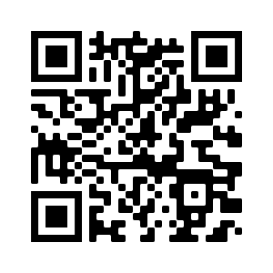

Scanning the QR code below will bring you to this repository.

  

# M897564 Non-Relativistic Quantum Mechanics (Second half)

|Date| Topics |Lecture notes|Homework|Resources|
|:--:|:------:|:-----------:|:------:|:-------:|
|T 30 Aug|Review of postulates of quantum mechanics, measurements|
|W 31 Aug|**No tutorial class**|
|Th 1 Sep|**No class**|
|T 6 Sep|
|W 7 Sep|
|Th 8 Sep|
|T 13 Sep|
|W 14 Sep|
|Th 15 Sep|
|T 20 Sep|
|W 21 Sep|
|Th 22 Sep|
|T 27 Sep|
|W 28 Sep|
|Th 29 Sep|
|T 4 Oct|
|W 5 Oct|
|Th 6 Oct|
|T 11 Oct|
|W 12 Oct|
|Th 13 Oct|
|T 18 Oct|
|W 19 Oct|
|Th 20 Oct|
|T 25 Oct|
|W 26 Oct|
|Th 27 Oct|

# [NASxIF Summer School for Young Physicists 2022](https://www.if.nu.ac.th/2022-nas-if-summer-school/)

Quantum Information are on Thursday 2 and 9 June. We will have a total of 8 one-and-a-half-hour lecture sessions and 2 tutorial sessions.

## Resources

* [BZ] Barton Zwiebach's [lecture notes for MIT8.05 Quantum Physics II](https://ocw.mit.edu/courses/8-05-quantum-physics-ii-fall-2013/pages/lecture-notes/), 2013
* [AH] Aram Harrow's [lecture notes for MIT8.06 Quantum Physics III](https://ocw.mit.edu/courses/8-06-quantum-physics-iii-spring-2016/pages/lecture-notes/), 2016
* [SW] Benjamin Schumacher and Michael Westmoreland, *Quantum Processes, Systems, & Information*, Cambridge University Press, 2010
* [JP] John Preskill, [lecture notes for Ph219/CS219 Quantum Computation](http://theory.caltech.edu/~preskill/ph219/index.html), Caltech
* [NC] Michael Nielsen and Isaac Chuang, *Quantum Computation and Quantum Information*, Cambridge University Press, 2000
<!--* [MK] Michael Kastoryano's [lecture notes on Quantum Error Correction](https://www.thp.uni-koeln.de/kastoryano/teaching.html), University of Cologne, 2019
* [Fu] Keisuke Fujii, "Stabilizer Formalism and Its Applications" in *Quantum Computing with Topological Codes*, Springer, 2015-->

The first three references are undergraduate level. The first one especially is for those who are not familiar with quantum mechanics done in a linear algebraic style (for example, those who have only seen David J. Griffiths' book.)

## Schedule

|Session| Topics | Resources |
|:----:|:--------------|:-------|
|1| **Formalism (AKA Quantum mechanics that we should know but are not taught in school)**   Scope of quantum information science, Review of the bra-ket notation and linear operators| BZ 2-4,7   SW 3-4.5|
|2| Axioms of quantum mechanics, Qubit |BZ 7, SW 2,  JP 2|
|3| Interference and Elitzur-Vaidman bomb tester, Composite systems and tensor product, Bell's theorem |   BZ 8, SW 6, JP 2 |   
|4| The concept of mixtures, Density operators and entanglement: reduced states, Schmidt decomposition, and purification, Teleportation |AH 3, SW 8, JP 2|
|T| Tutorial|[Problem Set 1](https://github.com/Ninnat/quantum-courses/blob/main/Problem%20sets/PSET1.pdf)   [Solutions 1](https://github.com/Ninnat/quantum-courses/blob/main/Problem%20sets/Sol1.pdf)|
|5| **Quantum computing**   Circuit model of computing, Universal gate sets and the Solovay-Kitaev theorem|AH 5, JP 5, NC 4|
|6| Grover's search algorithm|AH 5, JP 6, NC 6|
|7| Quantum phase estimation and quantum Fourier transform|JP 6, NC 5|
|8| No-cloning, Generalized dynamics and measurements, Non-unitary qubit dynamics and decoherence; T1 and T2 time |AH 3, JP 3, NC 8|
|T|Tutorial|[Problem Set 2](https://github.com/Ninnat/quantum-courses/blob/main/Problem%20sets/PSET2.pdf)   [Solutions 2](https://github.com/Ninnat/quantum-courses/blob/main/Problem%20sets/Sol2.pdf)|

<!-- ## Additional resources

* Dave Bacon's notes
* Steve Girvin's Les Houches lectures on [Quantum Error Correction and Fault Tolerance](https://arxiv.org/abs/2111.08894)-->

<!--## Course description
Quantum information science capitalizes on quantum weirdness. In these lectures, I will eventually focus on a particular application of quantum weirdness: quantum computing. The goal is to show you that primitives from quantum information theory such as teleportation can be applied in an interesting way.

## Tentative references
* [Ba] Leslie E. Ballentine, *Quantum Theory: A Modern Development*, World Scientific, 1998.
* [Pr] Preskill, lecture notes for Ph219/CS219 Quantum Computation, Caltech 
* [Ma] E.B. Manoukian, *Quantum Theory: A Wide Spectrum*, Springer, 2006.
* [C-T] Claude Cohen-Tannoudji, Bernard Diu, and Franck Laloë, *Quantum Mechanics*, 2 volumes, Wiley-VCH, 1977. 
* [Sh] R. Shankar, *Principles of Quantum Mechanics*, 2nd ed., Plenum Press 1994. 
* [Ba] Leslie E. Ballentine, *Quantum Theory: A Modern Development*, World Scientific, 1998.
* [SW] Benjamin Schumacher and Michael Westmoreland, *Quantum Processes, Systems, & Information*, Cambridge University Press, 2010. 

### Further resources

* [Lecture notes](http://bohr.physics.berkeley.edu/classes/221/1011/221a.html) for Physics 221A Quantum Mechanics by Robert Littlejohn, UC Berkeley-->
